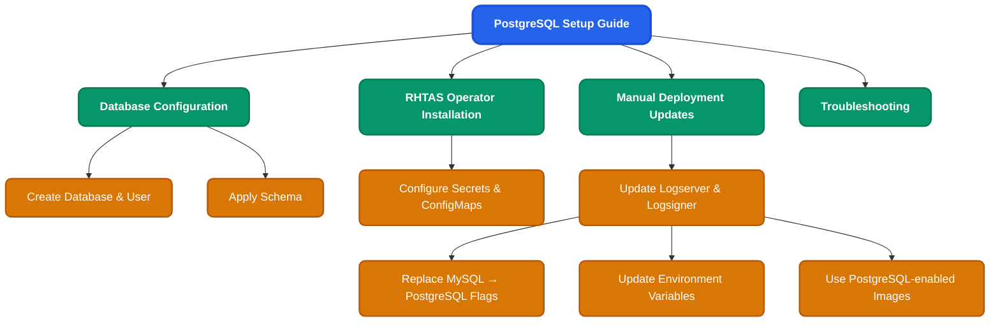

# Testing PostgreSQL as the Trillian backend database (Preview feature)

This is an experimental feature not yet officially supported in the stable RHTAS operator (version 1.3.1). It is used for testing purposes only. The setup requires manual modifications to the Trillian logserver & logsigner deployments after installation, as the operator currently defaults to MySQL. Ensure you have administrative access to your OpenShift cluster and a pre-existing PostgreSQL database ready for connection.

### PostgreSQL setup overview

## Prequisites
- OpenShift cluster with oc CLI installed and logged in.
- Access to a PostgreSQL database instance (e.g., AWS RDS PostgreSQL).
- [Optional:TLS] CA certificate bundle for your PostgreSQL database (e.g., rds-ca-bundle.pem).

## Steps
### Step 1: Configure Database for Trusted Artifact Signer 

1- From your workstation, log in to the database by providing the regional endpoint, the port, and the user credentials:
```
psql "host=<HOST> port=<PORT> user=<USER> sslmode=verify-full sslrootcert=<PATH_TO_CA_CERT>"
```
Example
```
psql "host=mydb.cluster-xyz.us-east-1.rds.amazonaws.com port=5432 user=postgres sslmode=verify-full sslrootcert=/path-to-ca-bundle.pem"

```

2- Create a new database named `trillian`:
```
CREATE DATABASE trillian;
```

3- Create a new database user named `trillian`, and set a PASSWORD for the newly created user:
```
CREATE USER trillian WITH PASSWORD '<POSTGRES_PASSWORD>';
GRANT ALL PRIVILEGES ON DATABASE trillian TO trillian;
```

4- Disconnect from the database:
```
EXIT
```

5- Download the database configuration file:
```
curl -o dbconfig.sql https://raw.githubusercontent.com/securesign/trillian/main/storage/postgresql/schema/storage.sql
```

6- Apply the database configuration to the new database
```
psql "host=mydb.cluster-xyz.us-east-1.rds.amazonaws.com port=5432 user=trillian dbname=trillian sslmode=verify-full sslrootcert=/path-to-ca-bundle.pem" -f dbconfig.sql
```

### Step 2: Create database configuration resources
1- Open a terminal on your workstation, and log in to OpenShift:
```
oc login --token=TOKEN --server=SERVER_URL_AND_PORT
```

2- Create a new secret containing the credentials for the Trillian database within the PostgreSQL instance which was created previously:
```
oc create secret generic trillian-db-config \
  --from-literal=postgresql-password="<POSTGRES_PASSWORD>" \
  --from-literal=postgresql-database="trillian" \
  --from-literal=postgresql-user="trillian" \
  --from-literal=postgresql-port="<DB_PORT>" \
  --from-literal=postgresql-host="<DB_HOST>"
```
3- Create a ConfigMap with the CA certificate for trusted connection to the database. Adjust the file path to your CA bundle:
```
oc create configmap db-trusted-ca --from-file=ca.crt=/path-to-ca-bundle.pem
```

### Step 3: Install RHTAS Operator (1.3.1) with custom database config
Using the [official deployment guide](https://docs.redhat.com/en/documentation/red_hat_trusted_artifact_signer/1.3/html/deployment_guide/index), install the RHTAS operator with the built-in MySQL deployment disabled. Configure it to use your PostgreSQL database by referencing the appropriate secret, and include the CA ConfigMap if PostgreSQL TLS is enabled.

In your Securesign CR:
```
trillian:
  trustedCA:
    name: db-trusted-ca
  database:
    create: false
    databaseSecretRef:
      name: trillian-db-config
```

### Step 4: Scale down the RHTAS Operator deployment

At this point, the operator will create the Trillian components.
The Trillian logserver and logsigner deployments will fail because both still expect MySQL as a backend database — this is expected.

Before modifying the deployments manually, scale down the operator to prevent it from reverting your changes:
```
oc scale deploy rhtas-operator-controller-manager --replicas=0 -n openshift-operators
```

### Step 5: Update the Trillian logserver & logsigner deployments (Manual change required)

1- Replace MySQL arguments with PostgreSQL ones
```
oc edit deploy trillian-logserver
oc edit deploy trillian-logsigner
```
- Remove / replace these MySQL flags:
```
--storage_system=mysql
--quota_system=mysql
--mysql_uri=...
--mysql_max_conns=30
--mysql_max_idle_conns=10
--mysql_tls_ca
--mysql_server_name
```
- Insert PostgreSQL equivalents:
```
--storage_system=postgresql
--quota_system=postgresql
--postgresql_uri=postgresql://$(DB_USER):$(DB_PASSWORD)@$(DB_HOSTNAME):$(DB_PORT)/$(DB_NAME)
--postgresql_tls_ca=/var/run/configs/tas/ca-trust/ca.crt # Optional: provide this flag if PostgreSQL TLS is enabled
```
(Other flags remain unchanged)

2- Environment variables (`spec.template.spec.containers[0].env`)
- Remove MySQL env block:
```
env:
- name: MYSQL_USER
  valueFrom:
    secretKeyRef:
      key: mysql-user
      name: trillian-db-config
- name: MYSQL_PASSWORD
  valueFrom:
    secretKeyRef:
      key: mysql-password
      name: trillian-db-config
- name: MYSQL_HOSTNAME
  valueFrom:
    secretKeyRef:
      key: mysql-host
      name: trillian-db-config
- name: MYSQL_PORT
  valueFrom:
    secretKeyRef:
      key: mysql-port
      name: trillian-db-config
- name: MYSQL_DATABASE
  valueFrom:
    secretKeyRef:
      key: mysql-database
      name: trillian-db-config
```
- Replace with:
```
env:
- name: DB_USER
  valueFrom:
    secretKeyRef:
      key: postgresql-user
      name: trillian-db-config
- name: DB_PASSWORD
  valueFrom:
    secretKeyRef:
      key: postgresql-password
      name: trillian-db-config
- name: DB_HOSTNAME
  valueFrom:
    secretKeyRef:
      key: postgresql-host
      name: trillian-db-config
- name: DB_PORT
  valueFrom:
    secretKeyRef:
      key: postgresql-port
      name: trillian-db-config
- name: DB_NAME
  valueFrom:
    secretKeyRef:
      key: postgresql-database
      name: trillian-db-config

```
#### What Changed
| Original                         | New                                     |
| -------------------------------- | --------------------------------------- |
| `MYSQL_USER` → `DB_USER`         | Maps to `postgresql-user` in the secret |
| `MYSQL_PASSWORD` → `DB_PASSWORD` | Maps to `postgresql-password`           |
| `MYSQL_HOSTNAME` → `DB_HOSTNAME` | Maps to `postgresql-host`               |
| `MYSQL_PORT` → `DB_PORT`         | Maps to `postgresql-port`               |
| `MYSQL_DATABASE` → `DB_NAME`     | Maps to `postgresql-database`           |

3- Update Init Container (`wait-for-trillian-db`)
Update env vars in the initContainer:
- Similar to above, replace env block with: 
```
env:
- name: DB_HOSTNAME
    valueFrom:
    secretKeyRef:
        key: postgresql-host
        name: trillian-db-config
- name: DB_PORT
    valueFrom:
    secretKeyRef:
        key: postgresql-port
        name: trillian-db-config
```
- Update the check command:
```
until nc -z -v -w30 $DB_HOSTNAME $DB_PORT; do echo \"Waiting for DB to start\"; sleep 5; done;",
```

4- Use the latest Trillian images:
```
# In logserver deployment, replace image:
registry.redhat.io/rhtas/trillian-logserver-rhel9@sha256:ca6b8828b51a029aa84ebe38f6b58443c85f1614fd24b6de4e82ae2e4dbeecd8
# With
quay.io/securesign/trillian-logserver@sha256:a61a94e802d54ff8e75f164775f7e294382b198cbb2cd01e2e5ec429c4f45e9e

# In logsigner deployment, replace image:
registry.redhat.io/rhtas/trillian-logsigner-rhel9@sha256:9e37877e090ff45151a2906538e833a9dcfbb93f933e687532272c927ead7510
# with
quay.io/securesign/trillian-logsigner@sha256:53a55f52adf05272ee41b9049d6ad9d853b019b005449145c8620ca88d078e3c
```

5- Permanently prevent the RHTAS operator from overwriting your changes when it's scaled up
- Once you saved the changes, add the `pause-reconciliation` annotation to both deployments:
```
oc annotate deployment trillian-logserver rhtas.redhat.com/pause-reconciliation="true"
oc annotate deployment trillian-logsigner rhtas.redhat.com/pause-reconciliation="true"
```

### Step 6: Scale up the RHTAS Operator deployment
- Verify that `trillian-logserver` & `trillian-logsigner` pods start successfully
Once verified, scale the operator back up:
```
oc scale deploy rhtas-operator-controller-manager --replicas=1 -n openshift-operators
```

Once the operator is up, it will deploys the remaining RHTAS resources.

## Troubleshooting
- If the pods still fail, ensure your PostgreSQL secret keys match exactly (e.g., `postgresql-host` not `mysql-host`).
- Connection issues: Verify CA bundle in configMap and PostgreSQL TLS settings.
- Revert changes: Scale down operator, delete/edit the deployment back to MySQL defaults, or reinstall the CR.